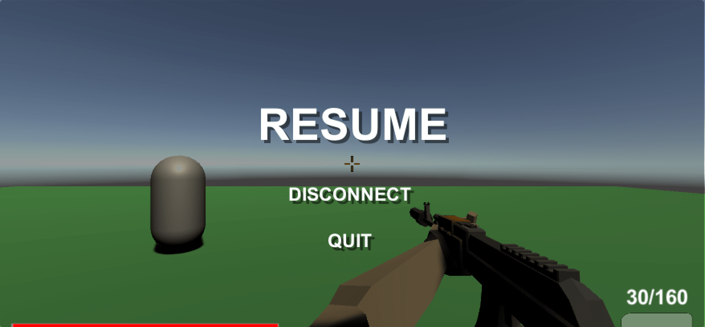

# Game Menus 

<sub>Author: Orwa Staif</sup>

## Main Menu 

bla bla bla 

## Pause Menu 

When you click the Escape key during the game a pause menu will appear with three buttons: 

 + Resume.
 + Disconnect from the server and takes you back to the Main menu.
 + Quit the game(does not work in the editor it works only after you build the game)



The pause Menu added inside the Test Map scene in a canvas 

```C# 
public class ResumeMenu : MonoBehaviour
{
    public static bool GameIsPaused = false;
    public GameObject pauseMenuUI;
    void Update()
    {
        if (Input.GetKeyDown(KeyCode.Escape))
        {
            if (GameIsPaused)
            {
                Resume();
                
            }else{
                Pause();
            }
        }
    }
    public void Resume(){
        pauseMenuUI.SetActive(false);
        GameIsPaused = false;
    }
    public void Pause(){
        pauseMenuUI.SetActive(true);
        GameIsPaused = true;
    }
}    
```

The diconnect button cut off the client from the server and distroy the GameObject which is the player. Also it displays the Main Menu again.

```C#
public void diconnect()
    {
        Debug.Log("disconnecting");
        Client.instance.Disconnect();
        Destroy(GameObject.FindGameObjectWithTag("Player"), 0f);
        SceneManager.LoadScene("MainMenu");
    }
```
The Quit button quit the game when the game already built

```C#
public void QuitGame()
    {
        Debug.Log("quiting game");
        Application.Quit();
    }

```
