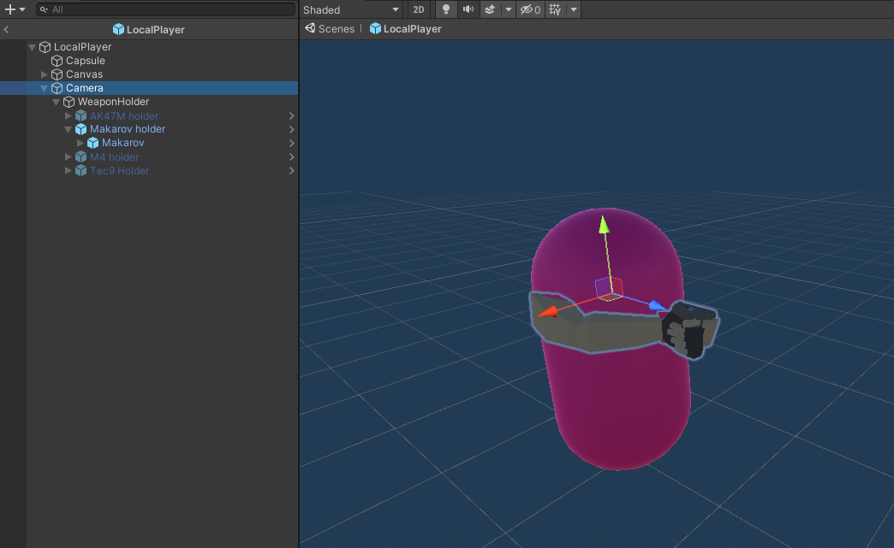
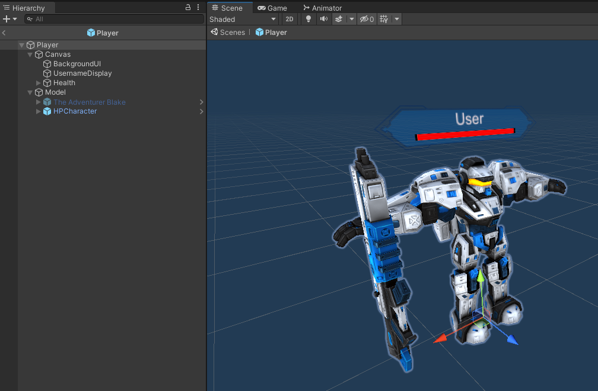
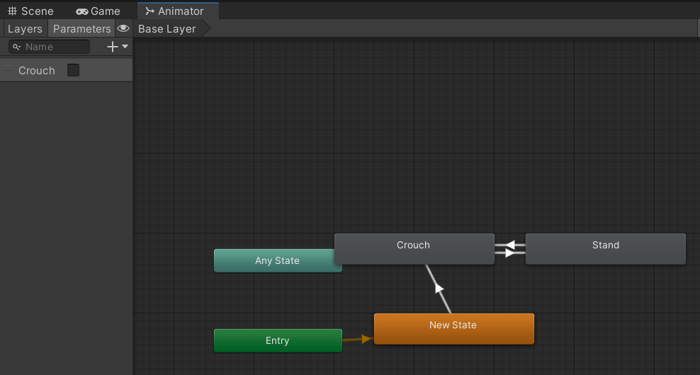
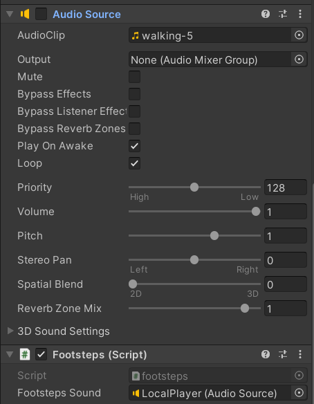
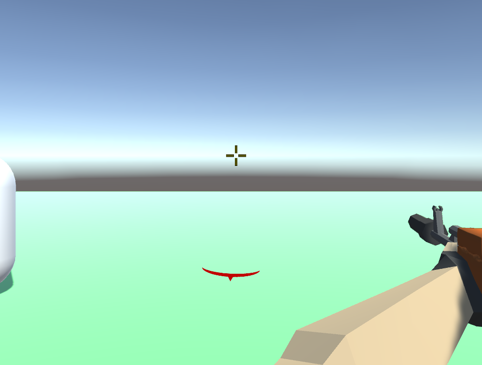
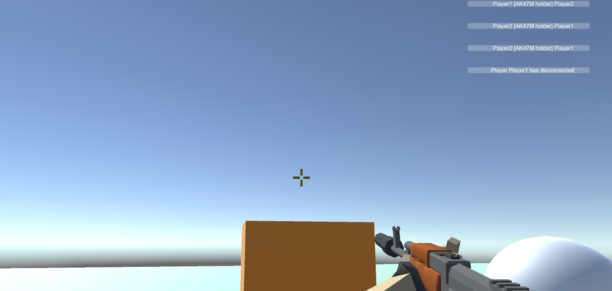

# Player
<sub>Author: Henrique Araújo</sup>
## Local Player vs Remote Player

The local player is the ````localPlayer```` prefab whilst the remote player is the ``player`` prefab. 

The local player is the player that the user is controlling. It will send information to the server about its inputs whilst the remote player is the visual representation of the other connected players.

### Local Player

Given the information [above](#local-player-vs-remote-player), the local player will hold the weapon models, as well as a camera. Since the user controlling it does not see any other models, we just render hands and weapons.



### Remote Player

Given the information [above](#local-player-vs-remote-player), player will be the representation of the other connected players. Because the current 3D models are free, we do not render the correct weapon/hands model. 



## Local Player

This game object is the most important one in the project. It is responsible for most of the user experience.

This includes:

+ Animations
+ Sounds
+ Player UI
+ Sending Inputs

### Animations

The animations of the local player and controlled by the ``LocalPlayer`` animatior controller.

Currently, there is only one animations that is player related (not weapon related), and that is the crouching. To trigger this animation, a boolean is used and is triggered whenever the client presses the ``C`` button.



### Sounds

Attached to the prefab, is a Audio Source component that is responsible for the footstep sounds. The FootSteps class is responsible for this.



### Player UI
#### Damage Indicators

Damage Indicators provide feedback as to where the local player is getting shot from. The Server Packet playerHealth comes with a Vector3 of the position that the client was shot from on the server. We render an image on the player's UI.



[Learn more about this here](../player/client_player.md#damage-indicators)

#### KillFeed

The killfeed provides the player with information about the current state of the game. This includes who joined/left the session as well as current kills happening.



[Learn more about this here](../player/client_player.md#killfeed)

#### Health Bar

The killfeed provides the player with information about the current state of the game. This includes who joined/left the session as well as current kills happening.


[Learn more about this here](../player/client_player.md#health-bar)

#### Ammo

The killfeed provides the player with information about the current state of the game. This includes who joined/left the session as well as current kills happening.


[Learn more about this here](../player/client_player.md#ammution)

### Sending inputs

Sending inputs to the server allows the server to compute a new game state. To do this, in the PlayerController class, we send an array boolean that is going to get read by the server.

```c#
 private void SendInputToServer()
    { 

        bool[] _inputs = new bool[]
        {
            Input.GetKey(KeyCode.W),            // 0
            Input.GetKey(KeyCode.S),            // 1
            Input.GetKey(KeyCode.A),            // 2
            Input.GetKey(KeyCode.D),            // 3
            Input.GetKey(KeyCode.Space),        // 4
            Input.GetKey(KeyCode.LeftShift),    // 5
            Input.GetKey(KeyCode.C),            // 6
            Input.GetKey(KeyCode.Mouse0),       // 7 
            Input.GetKey(KeyCode.R),            // 8

            
        };

        ClientSend.PlayerMovement(_inputs);
    }
```

Besides that, we also send a PlayerShoot packet giving the server the information as to where the player was facing once it shot.

```c#
if (Input.GetKey(KeyCode.Mouse0))
{
    ClientSend.PlayerShoot(camTransform.forward);
}
```