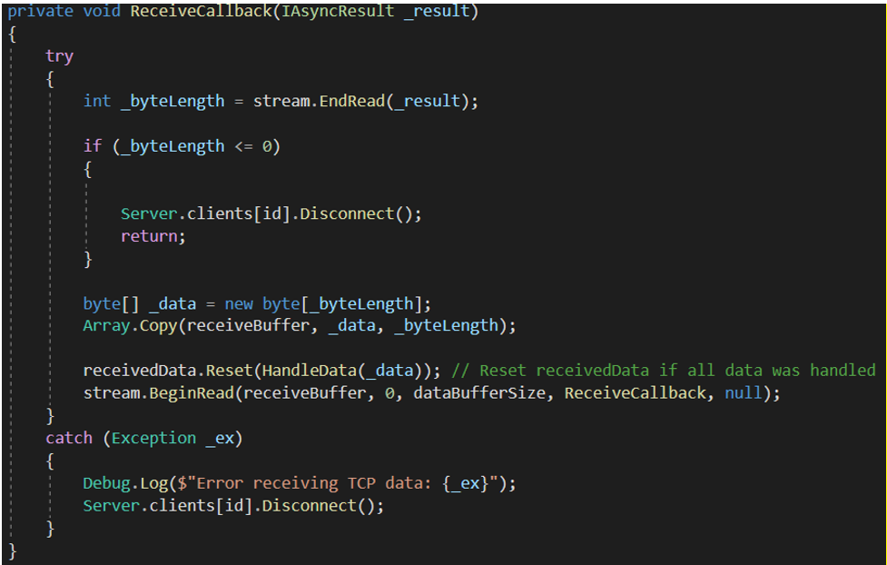
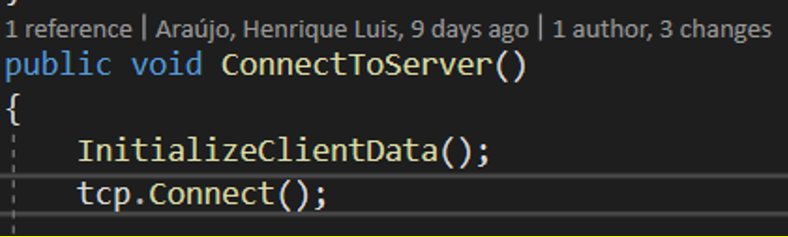

# TCP Connection

Author: Henrique Araújo

## Server

The first thing the server does when it starts, is start listening for incoming TCP connections. 

If you open up the server Unity Project and take a look in the hierarchy, you can see an empty game object named “NetworkManager”. Upon closer inspection of that object, you can see that there are two C# scripts attached to it:

+ NetworkManager.cs
+ ThreadManager.cs. 

For now, only the first one will interest us.

If you open up the NetworkManager.cs script, you will notice that on the Start method we first set the target frame rate to 30 frames per second. This limits how many times per second our game state is updated. In other words, the server’s tick rate.

You will also notice that we call a static method from the Server.cs script named Start passing the 50 as the maximum player count that our Server will handle and 26950 dictating the Port of the Server. This number was decided having in mind the well-known Port numbers.

If we drill down the code and take a closer look at Server.cs file, we can see that this class provides a few attributes that will be used on the Start method or the methods that follow it:

+	MaxPlayers
+	Port
+	Clients: dictionary of Integer, Client to store the connected client’s information.
+	packetHandlers: dictionary to map the client’s packet to a handler
+	TcpListener
+	UdpListener

On the Server.cs Start method, we start by initializing the variables passed as parameters and then we call the InitializeServerData method.

On the InitializeServerData method, we start by populating the “clients” dictionary. Note that, even though we have no connected clients, this is reserve slots for them according to the MaxPlayers attribute.

After that, we initialize the packetHandlers dictionary. This dictionary will map the incoming packets from different clients to an action on the server. Notice how we take an ID coming from the packet (through an enumerator called ClientPacket) and map it to a method in the ServerHandle.cs class. Please note that this dictionary is not crucial to the connection.

Back on the Start method, we now initialize the TCP listener passing as parameter IP. Any, which means that we don’t have to assign our server’s IP statically, so we just need to know the current IP address of the machine in which the server is currently running. Notice that this may change if there is a dedicated machine for the server.

We then call the listener’s Start method and BeginAcceptTcpClient method passing in the TCPConnectCallback method as the parameter and null as the transfer object.

On the TCPConnectCallback method, we first get the TCP Client returned by the TCP listerner’s EndAcceptTcpClient method. Once a player connects, we want to make sure that we continue listening to connections, so we recursively call the TCPConnectCallback method again.

After that we iterate through the client’s dictionary and determine if we have any available slots left. If we do, we assign the first available slot to the new connection through the Client.cs’s TCP Connect method.

On the Client.cs class, there is a subclass named TCP. This class is responsible for sending and receiving TCP data from the Client. On the Connect method, we first initialize the TCP related data of the newly connected client and we start reading the stream of data provided by the tcp listener passed by parameter as seen on the previous image. 

After that, we send a welcome packet to the client to trigger other connectivity related algorithms.

For now we will focus on the ReceiveCallback method since it is the method that handles the incoming data. In a first instance we call the stream’s EndRead method which waits for the pending asynchronous read to complete and returns the length of the bytes that we are going to read.

If that length is 0 or less (should never be less), we disconnect the player because the client is no longer connected to the server.
Next call the Packet’s (receivedData) Reset method passing in the Boolean method HandleData to check if all data has been handled and, if it is, reset the Packet (again, receivedData).

After that, we recursively call the ReceiveCallback method through the stream’s BeginRead method until all handle has been dealt with.
We wrap this logic in a try-catch block since there are a lot of point in which our code can throw an exception. In which case, we disconnect the player.

At this point the server has the ability to listen to new TCP connections but has no ability to send any data to it’s connected clients. Please note that for the sake of simplicity, a lot of already implemented methods were omitted in this explanation. This section only focuses on how the server is set up to listen to TCP connections. Eventually all of the remaining code will be referenced.

## Client

On the client side, we are now ready to establish a connection with the server. To analyze this, please turn your attention to the “Connect” button on the menu. You will see that it triggers the UIManager.cs ConnectToServer method which, as the name suggests, connects the client to the server.

Taking a closer look at the method, we can see that, besides doing some game logic, it calls the Client.cs’s ConnectToServer method.

On the Client.cs, we have a singleton situation. Furthermore, we set an integer attribute named dataBufferSize to 4096 (bytes) which corresponds to 4MB. We also have an ip, port and id attributes, as well as a reference to it’s TCP Class

On that TCP class, we have a method, similarly with the Server’s Start method, we have a call to the InitializeClientData method and a call to the subclass TCP’s Connect method. The InitializeClientData method is not crucial to the initial connection between Server and Client as it maps the Packet’s ID to a method or action.

On the Client.cs TCP class, we have a TcpClient reference named socket, a NetworkStream for reading the stream of data a Packet attribute and a receivedBuffer byte array.

### Connect

On the TCP class Connect method, we use the parent’s class (Client) attributes to create a new TcpClient and assign it to the socket attribute. After that we refine the TCP’s receivedBuffer byte array to be length of the one defined on the parent class. Then we can call the TcpClient’s (socket) BeginConnect method, passing the singleton variable instance’s ip, port, the ConnectCallback method as a callback method and the TcpClient we just created.

### Connect Callback

On the ConnectCallback method, we first call the socket’s EndConnect passing in the IAsyncResult as the parameter, then we check if the socket is connected or not in which case we return the method. Then we assign the stream attribute the the socket’s stream attribute and similarly to the Server, we call the stream’s BeginRead method passing in the corresponding attributes and the ReceiveCallback method.

### Receive Callback

For now we will focus on the ReceiveCallback method since it is the method that handles the incoming data. In a first instance we call the stream’s EndRead method which waits for the pending asynchronous read to complete and returns the length of the bytes that we are going to read.

If that length is 0 or less (should never be less), we disconnect the player because the client is no longer connected to the server.
Next call the Packet’s (receivedData) Reset method passing in the Boolean method HandleData to check if all data has been handled and, if it is, reset the Packet (again, receivedData).

After that, we recursively call the ReceiveCallback method through the stream’s BeginRead method until all handle has been dealt with.
We wrap this logic in a try-catch block since there are a lot of point in which our code can throw an exception. In which case, we disconnect the player.

At this point, the server can recognize the connection from the client. But it is worth noting that there is not yet an implementation for the sending of traffic between the hosts. 