# Networking Overview

<sub>Author: Henrique Araújo</sup>

The networking is composed by one Server and one (or more) Client(s).
In this sense, the client sends inputs to the server (eg. AWDS keys for movement), the server then performs actions based on these inputs (eg. move the player), and then sends the new gamestate back to all connected clients.

## Network flow

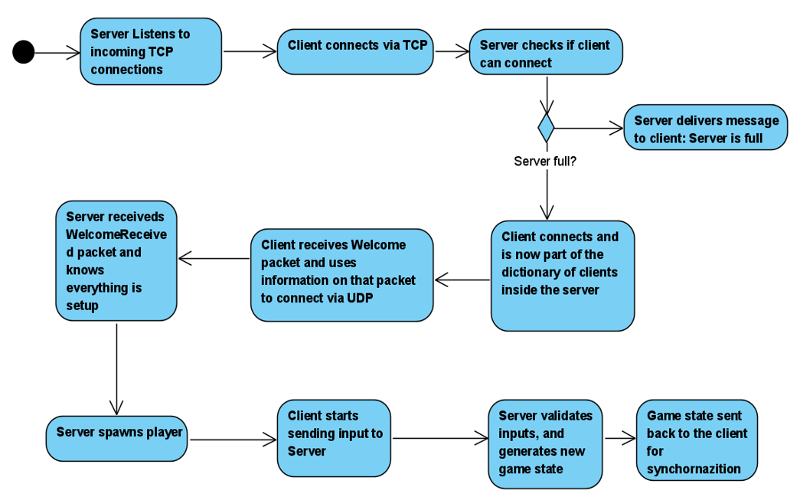

## Server Project
Below, you can find an overall UML diagram on how the server is setup. Every entity represents a class in the server project.

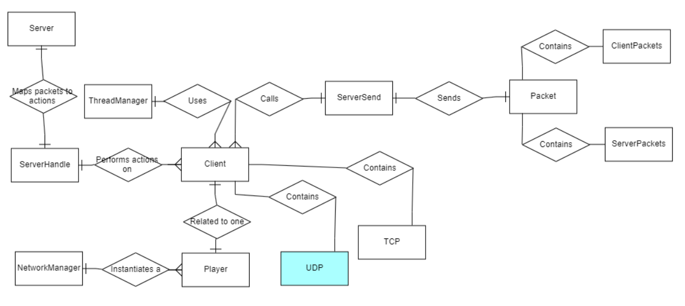

### Server classes and their role

#### Server
Responsible for setting up the IP connection with the client(s), listen for UDP and TCP packets and initializing the PacketHandler's dictionary.
The PacketHandler class is a C# .NET built-in class that helps attribute a packet to a method.

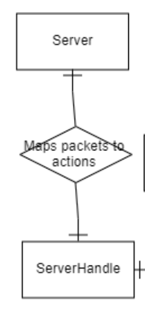

#### ServerHandle
Responsible for performing actions through methods upon receiving of a client packet. Most often than not, it performs this action on the client class. Although, in theory, it can affect any other class that changes the gamestate.
These methods get called through the Server's PacketHandler dictionary.

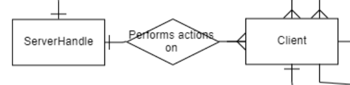

#### Client
Responsible for all the networking logic that affects the clients, for example:
+ Connecting
+ Disconnecting
+ Reading data streams (TCP and UDP)
+ Calling the method that is mapped to an incoming packet through the Server's PacketHandler's dictionary.
+ Sending packets back to the connected clients

There is one instance of this class per connected client. 

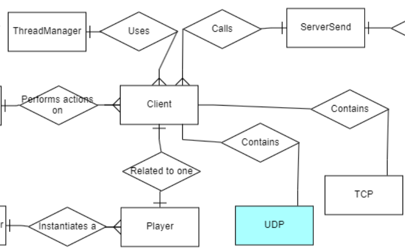

#### Player
Responsible for changing the game state. 
When a connected clients sends inputs, acts upon that. This class is associated with an instanciated game object that represents a certain connected client on the server.

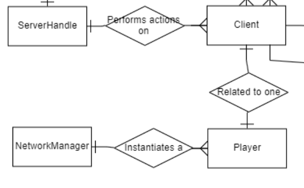

#### Network Manager
Responsible for instanciating a client into the server's game world. Also responsible for removing that client when it disconnects.

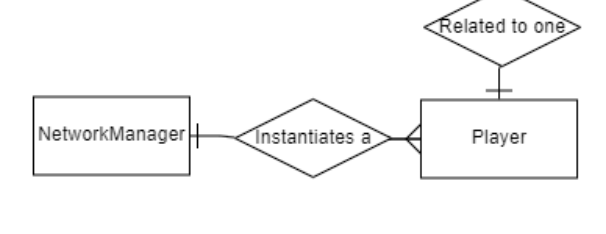

#### Server Send
Responsible for sending server packets to all, one or all but one client(s).

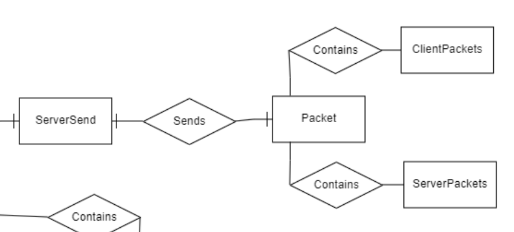

#### Packet
Responsible for the strucutre of the packet. It contains an array byte in which we can put data in (eg. String, Integer, Vector3). It must be read on the receiving end in the same way it was written. This means if, for example if we write a packet like so

```C#
int ID = 1;
string username = "myUser";
packet.Write(ID);
packet.Write(username);
```

then we have a packet that looks like this 

```
[1, "myUser"]
```

and so, when reading this packet, we have to respect the order in which the data types are written.

```C#
int ID = packet.ReadInt();
int username = packet.ReadString();
```

Contains multiple methods for reading and writting to a packet. Some of these methods include:

- Read/Write Vector3
- Read/Write Quaternion

It also contains two enumerators:

+ **ClientPackets** : packets that the client sends to the server (Client -> Server)
+ **ServerPackets** : packets that the server sends to one, all or all but one client (Server -> Client)


## Client Project

The image below represents an overall UML diagram dicpicturing how the client is setup. Every entity represents a class in the client project.

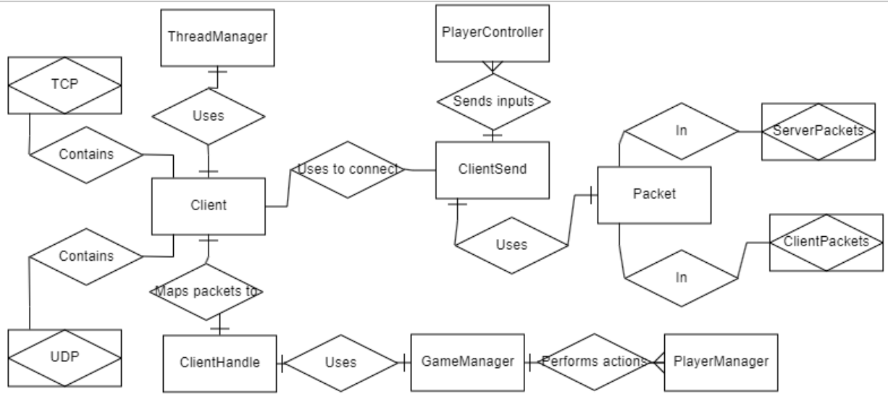

### Client classes and their role

#### Client

Responsible for setting up the TCP and UDP networking logic. This includes connection callbacks, receiving data, sending data and disconnecting.
This class also contains the PacketHandler dictionary that servers to map incoming packets from the server to actions in a client instance.
In the client project, there is only one Client class instance.

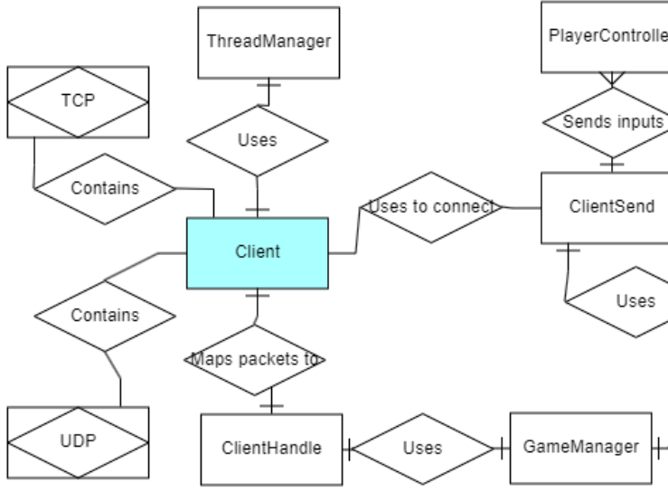

#### ClientHandle

Contains the logic that an incoming packet triggers.

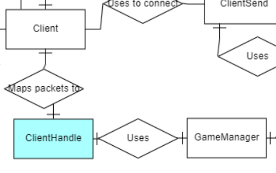

#### GameManager

Contains information about other clients connected to the same server in order to render the server's game state.

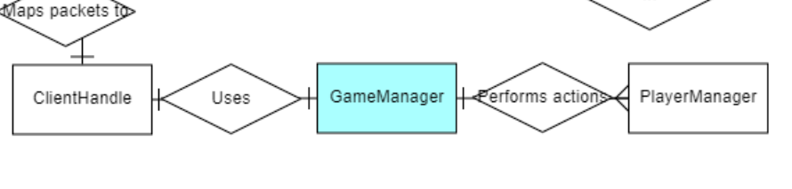

#### PlayerManager

Responsible for synchornizing all connected players in a certain client instance. This includes:

+ Id
+ Username
+ Health

This class is applied to the Player game object as well as the localPlayer gameobject.

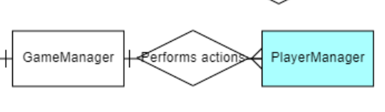

#### PlayerController

Responsible sending the connected client's inputs to the server.

Also used for client side game logic (shooting sound, walking sound... etc.) performed upon the inputs mentioned above.

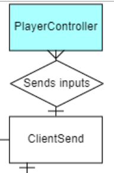

#### Enemy

Applied only to the Player game object (other connected players).

Responsible for performing actions upon other connected client's inputs. This happens so the client's game state can, for example, play an animation if they are pressing a button.

<sub><sup>NOTE: The name of this class can be misleading in the future. If teams are implemented into the game, all Player game objects will have an Enemy class but they might belong to the same team. A good replacement for this name would be "RemotePlayer".</sup></sub>

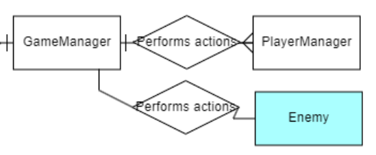

#### ClientSend

Used to send packets to the server. It uses the Packet class to create a new array of bytes that is going to contain the data that a client sends to the server.

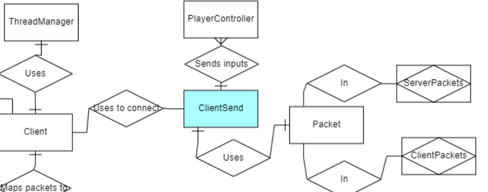

#### Packet

Responsible for the strucutre of the packet. It contains an array byte in which we can put data in (eg. String, Integer, Vector3). It must be read on the receiving end in the same way it was written. This means if, for example if we write a packet like so

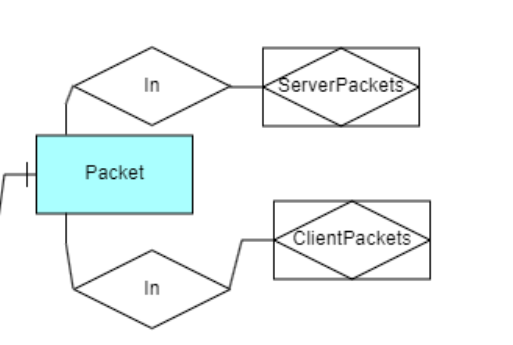

```C#
int ID = 1;
string username = "myUser";
packet.Write(ID);
packet.Write(username);
```

then we have a packet that looks like this 

```
[1, "myUser"]
```

and so, when reading this packet, we have to respect the order in which the data types are written.

```C#
int ID = packet.ReadInt();
int username = packet.ReadString();
```

Contains multiple methods for reading and writting to a packet. Some of these methods include:

- Read/Write Vector3
- Read/Write Quaternion

It also contains two enumerators:

+ **ClientPackets** : packets that the client sends to the server (Client -> Server)
+ **ServerPackets** : packets that the server sends to one, all or all but one client (Server -> Client)