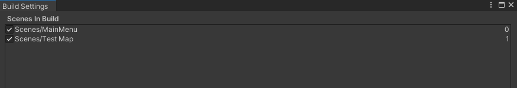
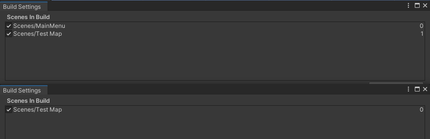
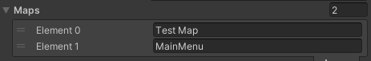
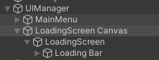

# Maps & Scenes

<sub>Author: Henrique Araújo</sup>


A map is a Unity Scene that is going to be loaded dynamically. The available scenes can be found under ```File -> Build Settings``` on the Unity editor.



Note that each scene has an **index** associated with it.

A scene can represent either a map or a menu. A map is a game world in which a user can control a player on the server that is going to be represented in it's own client instance. A menu is a scene in which a user can navigate through options and connect to a server.


## Build settings synchornization

To keep both Client and Server's scene **indexes** synchornized, the Client has as it's first scene the Menu scene with an index of 0 and the rest of the scenes represent maps.

Since we don't need a menu on the server, the first scene already represents a map with a scene index of 0.

In this sense, the Server's and Client's scene indexes are offset by 1. In the following image you can verify this (top client, bottom server)



### Transmitting the server's scene index

The scene index is transmitted within the SpawnPlayer Server Packet. Upon receiving this information, the  [map is loaded](#loading-the-scene-stage). This is done through the LevelManager's class ``Maps`` array. 

There needs to be a direct synchornization between the Server's build setting's scene index and the Client's LevelManager array.



## Map loading

### Loading Screen

The loading screen consists of a slider that is depicts the current loading state of the map. To accomplish this, under the ``UIManager`` game object, there a canvas named ``LoadingScreen canvas`` that consists of a slider named ``loading bar``



### Loading Stages

The map loading logic is devided by two:

1. Connecting to the server - 0% to 50%
2. Loading the scene - 50% to 100%

These stages are not absolute, but called upon through the ``LevelManager``. In this class is responsible for 

+ Displaying the loading screen 
+ Updating the slider with the loading progress
+ Hidding the loading screen when the scene is loaded

#### Connecting to the server stage

The UIManager's class ``ConnectToServer`` method is responsible for connecting the client to the server. When it get's called, we initialize the loading screen.

```c#
public void InitializeLoadingScreen()
{
    loadingScreen.SetActive(true);
    SetServerConnectionProgress(0);
}
```

When the Server Packets are initialized on the Client's class ``InitializeClientData`` method, we set the progress to 10%.

```c#
    LevelManager.instance.SetServerConnectionProgress(10);
```

Upon a successful TCP connection to the server has been established on the end of the Client' class TCP class ``Connect`` method, we set the progress to 25%.

```c#
LevelManager.instance.SetServerConnectionProgress(25);
```

Finally, after a successful UDP connection to the server has been established on the end of the Client's UDP class ``Connect`` method, we set the progress to 50%.

```c#
LevelManager.instance.SetServerConnectionProgress(50);
```

#### Loading the scene stage

Since the SpawnPlayer packet is only received after the previous steps, we can now load the scene.

To do this, on the GameManager class ``SpawnPlayer`` method, before we actually spawn the player, we await for the scene to load.

```c#
if (_id == Client.instance.myId)
{
    // If the server is initializing our player, we load the scene aswell
    await levelManager.LoadSceneAsync(_sceneID);

    _player = Instantiate(localPlayerPrefab, _position, _rotation);
}
```

The ```LoadSceneAsync`` method now uses Unity's ``Scene Manager`` class to load the scene dynamically. Within this operation, we can retreive the percentage of the scene loading. After it is complete, we hide the loading screen.

```c#
public async Task LoadSceneAsync(int _mapID)
{
    AsyncOperation operation = SceneManager.LoadSceneAsync(maps[_mapID]);
    
    while (!operation.isDone)
    {
        float progress = (Mathf.Clamp01(operation.progress / 0.9f) / 2) + 0.5f; // 50% of the loading slide
        slider.value += progress;
        Debug.Log(progress);
        
        await Task.Yield();
    }

    loadingScreen.SetActive(false);
}
```