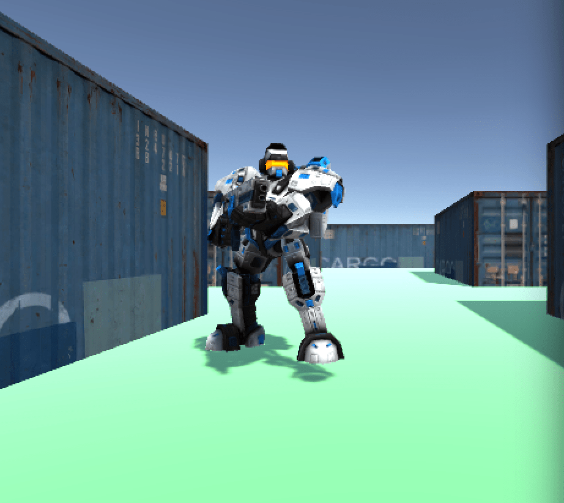
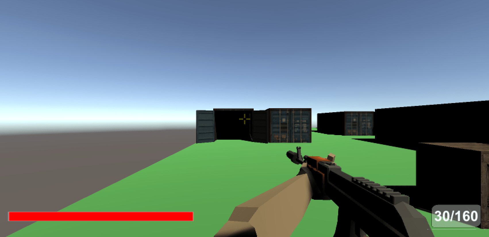

# Player

<sub>Author: Orwa Staif</sup>

## Player Movements  

### Position

The Player movement is mainly held in the server side of the game. So the server recieves the inputs from the client, thus the position of the player is determined.

```C#
public static void PlayerMovement(int _fromClient, Packet _packet)
    {
        bool[] _inputs = new bool[_packet.ReadInt()];
        for (int i = 0; i < _inputs.Length; i++)
        {
            _inputs[i] = _packet.ReadBool();
        }
        Quaternion _rotation = _packet.ReadQuaternion();

        Server.clients[_fromClient].player.SetInput(_inputs, _rotation);
    }
```
The UDP package will be checked every second. The server start reading the input in the order and it will set the attributes of inputs and rotation.

```C#
public void SetInput(bool[] _inputs, Quaternion _rotation)
    {
        inputs = _inputs;
        transform.rotation = _rotation;
    }
```


It send the player’s position and rotation to all connected clients, through the PlayerPosition and PlayerRotation methods.

```C#
public static void PlayerPosition(Player _player)
    {
        using (Packet _packet = new Packet((int)ServerPackets.playerPosition))
        {
            _packet.Write(_player.id);
            _packet.Write(_player.transform.position);

            SendUDPDataToAll(_packet);
        }
    }

    public static void PlayerRotation(Player _player)
    {
        using (Packet _packet = new Packet((int)ServerPackets.playerRotation))
        {
            _packet.Write(_player.id);
            _packet.Write(_player.transform.rotation);

            SendUDPDataToAllExeptOne(_player.id, _packet);
        }
    }
```
The AnimationHandler method responsible for the animation of the movments of the player.

### Couching 

the crouch is implemented as the following formula: 

```C#
        if (_keydown)
        {
            anim.SetBool("Crouch", true);
            moveSpeed = crouchSpeed;
        }
        else
        {
            anim.SetBool("Crouch", false);
            moveSpeed = walkSpeed;
        }
```
taking into consederation the speed which should be lower if the player is crouching. 



### Sprinting 

the sprinting formula has a similar logic to the crouching but the moving speed wil be higher obviously when the player is sprinting. Moreover, sprinting can't be made if the player is crouching.


```C#
    if (isCrouching)
        return;

        if (_keydown)
        {
            moveSpeed = sprintSpeed;   
        }
        else
        {
            moveSpeed = walkSpeed;
        }
```
## Health

### Take damage 

First We check if the health not equal or less than zero to procceed. Then simply we subtract the damage from the player’s current health and check if it is now below or equal to zero. If it is, we start by disabling its ability to move and set a new position for it (respawn point). We have to send this new position back to all clients, as we do for every movement the player makes on the server side.

```C#
public float TakeDamage(float _damage, Player _fromPlayer, Weapon weapon)
    {
        if (health <= 0f)
        {
            return health;
        }

        health -= _damage;
        if (health <= 0f)
        {
            Die();
            KillFeed(_fromPlayer, weapon);
        }

        ServerSend.PlayerHealth(this);
        ServerSend.DamageIndicator(this, _fromPlayer);

        return health;

    }
```
### Die

The die method take the player out while the server is repositioning the player to it’s respawn position

```C#
private void Die()
    {
        health = 0f;
        controller.enabled = false;
        StartCoroutine(Respawn());
    }
```