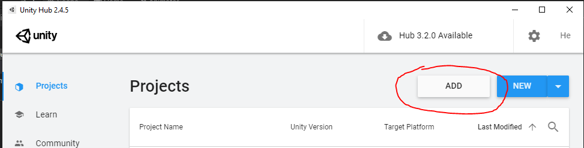
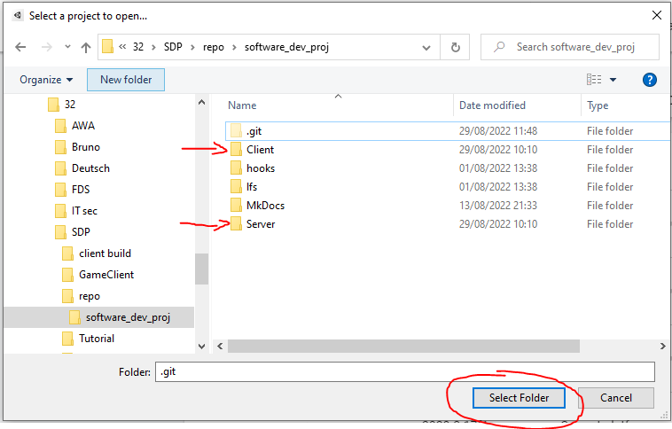
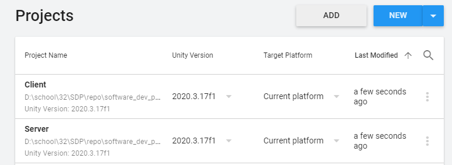
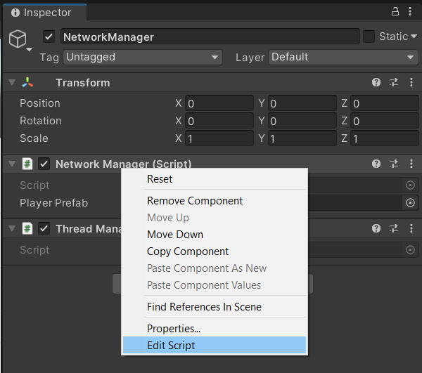
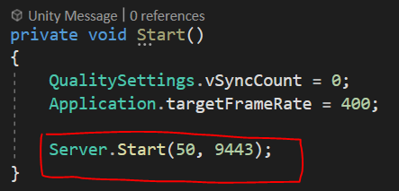
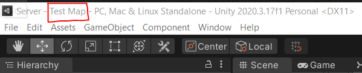
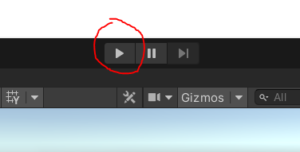
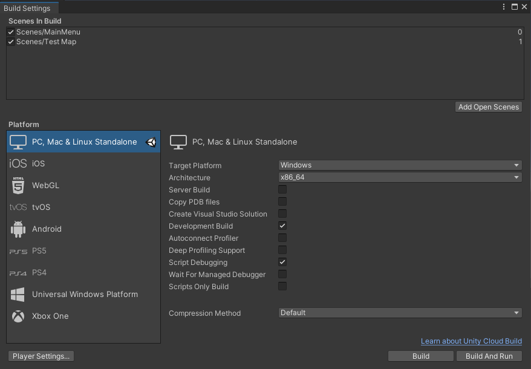
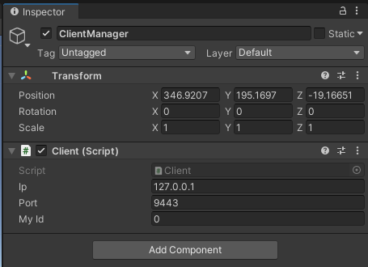
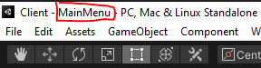

# User Guide

Author: Henrique Araújo

## Project Composition
This project consists on two seperate Unity projects:

1. The Server
2. The Client

The Server's responsibility is to listen for client connections and inputs and render the game state.

Over on the Client, we send inputs to the Server and it responds with information about our player as well as other connected players. This information includes

+ Position
+ Rotation
+ Health
+ Speed
+ etc

## Set-up

To run the project, you first need to download [Unity Hub](https://public-cdn.cloud.unity3d.com/hub/prod/UnityHubSetup.exe).

After that, you then need to download and install [Unity version 2020.3.17f1](unityhub://2020.3.17f1/a4537701e4ab).

Upon instalation, you can now import both Server and Client projects to UnityHub. To do this, you click on the ``Add`` button and select both Client and Server folders. Some UnityHub versions allow for multiple imports at the same time. If yours doesn't, you need to import them one by one.

.

.

After adding both folders, you should see them on UnityHub. Depending on your version of UnityHub, you might need to open the software again.

.

You should now be able to click on the projects to open them.

### Server project

On the server project's Hierarchy, there is an empty game object named ``NetworkManager``. In it, there is a script component containing the class NetworkManager. Open this file by right click on its name and selecting ``Edit script``.

.

On a file editor, local the ``Start`` method. In it, you can set the maximum ammount of players, as well as the server's port number.

Note that the server's IP address is always the same as the machine it is running on.

.

Make sure you are on the ``Test Map`` scene. You can check this on the Editor's window.

.

You can now press the Unity Editor's play button to start the server.

.

#### Building the server

To create a production ready version of this project, go to ``File -> Build Settings``. Make sure the ``Server Build`` option is selected and press ``Build``.

.

### Client project

On the Client's project Hierarchy, there is an empty game object named ``Client Manager``. In it, you need to set the connection data. This is:

+ The server's IP address
+ The server's Port number

If you are going to run the server on the same machine, you can set this to be localhost (127.0.0.1). The port number can be altered and should be double-checked on the Server project.

.

Make sure you are on the ``MainMenu`` scene. You can check this on the Editor's window.

.

You can now press the Unity Editor's play button to start the client.

.

After it starts, choose a user name, your primary and secondary weapons and press the ``Connect`` button.

#### Building the client

To create a production ready version of this project, go to ``File -> Build Settings`` and press ``Build``.

.