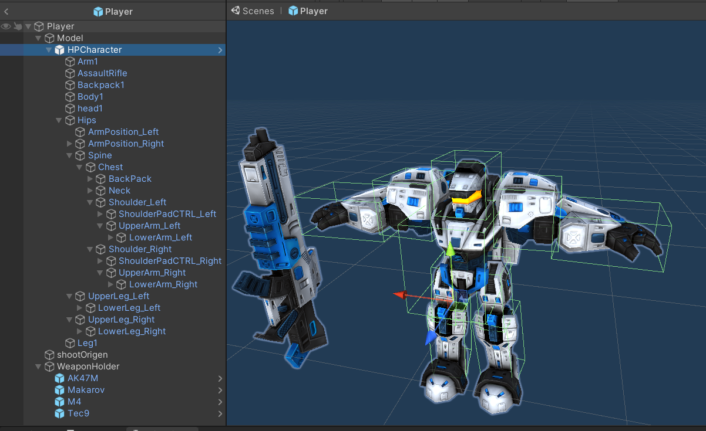

# Damages and Hitboxes

<sub>Author: Henrique Araújo</sup>


Damage is the consequence of a player shooting another player, whilst Hitboxes are what the player shooting is hitting on the enemy player. This is the responsibiliy of the server.

## Hitboxes

A Hitbox is a box collider attached to the bones of the player model. In that way the Hitbox (collider) moves according to the animation that a player is playing.

Currently there are 4 types of Hitboxes that are applied to the Player's model:

+ Head
    + head1
+ Torso
    + Body1
+ Arms
    + UpperArm_Left
    + LowerArm_Left
    + UpperArm_Right
    + LowerArm_Right
+ Lets
    + UpperLeg_Left
    + UpperLeg_Left
    + UpperLeg_Right
    + LowerLeg_Right



### Hitbox Handler class

The HitboxHandler class is responsible for attributing damage multipliers to a certain hitbox depending on its type. It contains a Player class reference that must be manually added for every hitbox.

```C#
public Player playerScript;
[HideInInspector] public float damageMultiplier;

enum Type { Head, Torso, Legs, Arms};
[SerializeField] Type type;

private void Start()
{
    switch (type)
    {
        case Type.Head: damageMultiplier = 4; 
            break;
        case Type.Torso: damageMultiplier = 1.2f; 
            break;
        case Type.Legs: damageMultiplier = 0.9f;
            break;
        case Type.Arms: damageMultiplier = 0.9f;
            break;
        default: damageMultiplier = 1; 
            break;
    }
}
```

### Hitboxes and Layer Matrix

As previously stated, a hitbox is a collider, however, it's porpouse is not collision detection. Instead its porpouse is to get hit by a RayCast when a Player shoots another Player (more on [shooting](weapons.md#shooting)).

To achieve this, every hitbox has a "Hitbox" layer associated with it. When we are [shooting](#shooting), we look for that layer and that layer only. We also disabled that layer from collisions with default layers (everything else) in the layer matrix.


## Shooting

When a player shoots ([Player Shooting](../gamelogic/player_shooting%2C_health_and_respawn.md#shooting)), the Weapon's shoot method is triggered. In there, it casts a ray from the shootOrigin game object that only checks for collisions on the "Hitbox" Layer.

If it detects a hit, we know that what it hits has a Hitbox Handler class attached to it, so it grabs the hitboxes damage multiplier and uses that to send the Weapon's damage * the multiplier to the enemy's Player class TakeDamage method.

```C#
if (Physics.Raycast(shootOrigin.position, viewDirection, out RaycastHit _hit, 25f, LayerMask.GetMask("Hitbox")))
{

    HitboxHandler HH = _hit.collider.GetComponent<HitboxHandler>();

    if (HH.playerScript.id == owner.id)
        return;

    float damageMultiplier = HH.damageMultiplier;

    float other_health = HH.playerScript.TakeDamage(damage * damageMultiplier, owner, this);
    
    if (other_health <= 0)
        ServerSend.KillNotification(owner);

    Debug.Log(HH.name);
    
}
```