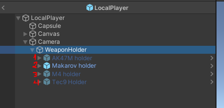
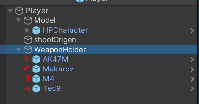

# Weapon Switching

Author: Henrique Araújo

This module will cover how the weapons a player has gets tracked (primary and secondary weapons), as well as the weapon he/she has selected.

Weapon switching is client authoritative in order to avoid game breaking latency. In this sense, the player selects the weapons that it wants for primary and secondary and sends that information over to the server for synchornazation. 

## Overview

Before continuing, it is important to be acquainted with the following terms:

+ **primary weapon** - a weapon that a player can use when he presses the primary button for switching weapons. 
+ **secondary weapon** - a weapon that a player can use when he presses the secondary button for switching weapons. 
+ **weapon selected** - the type of weapon a player selects depends on weather they have the primary or secondary slot selected. This can be 0 or 1 
+ **weapon ID** - each weapon has an ID that will be associated with the primary weapon slot and secondary weapon slot.

In this sense the WeaponSwitching class will have the following attributes:

+ **primary weapon ID** - to know what weapon it should enable as a primary, given a user input
+ **secondary weapon ID** - to know what weapon it should enable as a secondary, given a user input
+ **weapon selected** - changes on user input. Will alternate between the primary weapon and secondary weapon

Everytime the player switches weapons, it sends a **WeaponSelected** [Client Packet](../netcode/Packets.md#client-packets) to the server so it can know what weapon a player has selected at a given time.

Likewise, when a player selects what weapons it wants for primary and secondary weapons, it sends a **WeaponsID** [Client Packet](../netcode/Packets.md#client-packets) informing the server what weapons it has on those two slots.

## Client

The weapons a player can choose from can be found under the LocalPlayer prefab's WeaponHolder game object. **Note that a player has every weapon as a child of this game object, correctly ordered by their IDs**. This is because, in runtime, we will be adding these child game objects to WeaponSwitching class weapons array.

 

Likewise, it is also necessary to add the weapons to the GameManager's weapons array by order of their IDs.

 

Whilst on the weapon holder, we will use the array to enable/disable the weapons based on user input, on the game manager we will use the array to display a menu so that a user can choose and initialize what weapons it wants as primary and secondary.

## Server

Similarly to the client, the weapons can be found under the Player prefab's WeaponHolder game object as children. **Note that a player has every weapon as a child of this game object, correctly ordered by their IDs**

Because we're getting the Primary Weapon and Secondary Weapon ID, as well as the Selected Weapon integer from the client, the synchornazation is complete.

## How to

##### Make a weapon available for gameplay

- On the Client

    + Have a weapon game object as a saved prefab
    + Adding the weapon prefab to the localPlayer's WeaponHolder game object, keeping the order of the Weapon's IDs.
    + Adding the prefab to the GameManager's weapons array
    + Making sure every array and child game objects has their weapon's ID sequentially

- On the Server

    + Have a weapon game object as a saved prefab (empty game object)
    + Adding the weapon prefab to the localPlayer's WeaponHolder game object, keeping the order of the Weapon's IDs.
    + Making sure the child game objects has their weapon's ID sequentially

##### Weapon Switching Inputs

The weapon switching inputs can be found on the WeaponSwitching class Keys array. This array **must always be of size 2**.

The first index of the array corresponds to the input that triggers a selection of the primary weapon. The second index of the array corresponds to the input that triggers a selection of the secondary weapon.

