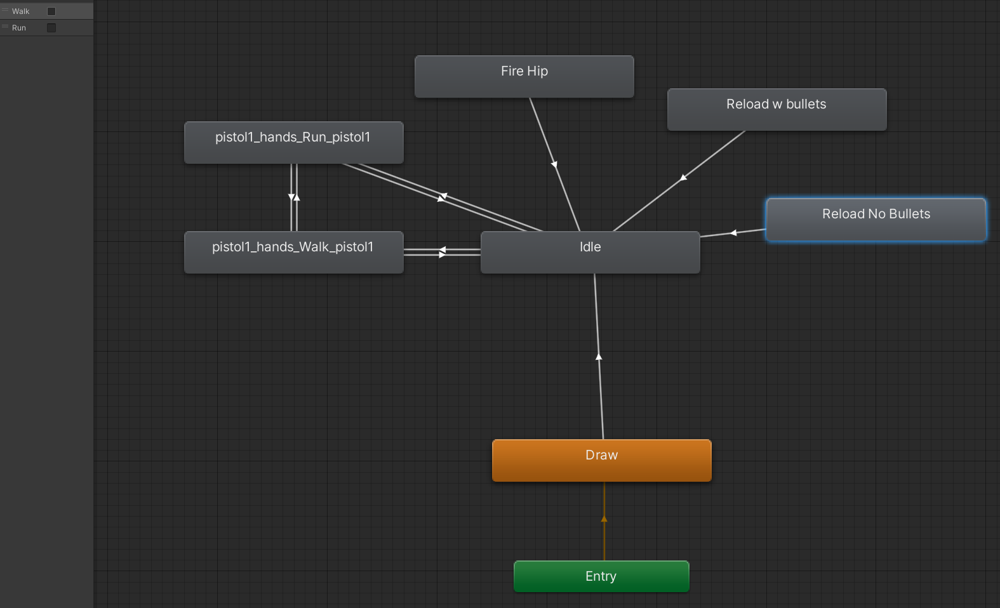

# Weapons

<sub>Authors: Henrique Araújo and Orwa Staif</sup>


In this module we'll cover how the Weapon class works, as well as how to create a weapon. Note that this module does not cover how to make that weapon available for gameplay. Please refer to [Weapon Swtiching](weapon_switching.md) to learn how to make a weapon available for gameplay.

## Client

The Client's Weapon system is responsible for visual indicators the weapon's firing and handleing. 

The weapon's game object anatomy consists of the following structure:

+ Holder
    + Weapon class
    + Audio Source
+ Model
    + Animator

### Weapon class

The weapon class performs the tasks assigned to the Client's weapon system mentioned above. It uses the Audio Source to play gunshot and reload sounds, and the model's Animator to trigger animations.

#### Ammunition system

The ammunition system is responsible for giving visual indicators to what it's happening on the server when the player shoots the weapon. It works based on three variables:

```C#
public int maxAmmoInMagazine;
public int currAmmo;
public int TotalAmmo;
```

**These variables are synchronized by hand between the server and the client**

+ **maxAmmoInMagazine** -
    + represents the maximum ammount of ammunition that a player can shoot when the weapon is reloaded.
    + We use this value to update the currAmmo value when a player wants to reload.

+ **currAmmo**
    + represents the current ammount of ammunition that a player has currently. This value decreases when the player shoots.
    + We use this value to update the UI's ammunition count text. (formatted like so: currAmmo/TotalAmmo)

+ **TotalAmmo**
    + represents the current ammount of ammunition that a player has left over. This is calculated by the formula **TotalAmmo - currAmmo**
    + We use this value to update the UI's ammunition count text. (formatted like so: currAmmo/TotalAmmo)

#### Fire Rate system

The fire rate variable is responsible for determining how fast a weapon can shoot, as well as if it is automatic or semi-automatic.

```C#
public float fireRate;
```

**This variable is synchronized by hand between the server and the client**

A weapon is **automatic** if the variable is greater than Zero and **semi-automatic** if it is equal to Zero.

It is important to note that the logic for the automatic mode is made on the ````FixedUpdate```` method because it is linked to the Server's tick rate. That way, the automatic fire is synchronized across instances.

On the other hand, the semi-automatic mode is made on the ````Update```` method because a player can shoot in between Server ticks.

#### Reloading system

The reload works by the following formula:

```C#
if (TotalAmmo >= maxAmmoInMagazine){
    TotalAmmo = TotalAmmo - maxAmmoInMagazine + currAmmo;

    currAmmo = maxAmmoInMagazine;
}else{
    currAmmo = TotalAmmo;
    TotalAmmo = 0;
}
```

This way, we follow the normal FPS reloading mechanic that it never looses ammunition on reloading (we keep the remaining ammunition that is on the magazine).

The reloading system has a variable to control the reload time that a certain weapon takes.

**This variable is synchronized by hand between the server and the client**

#### States

A weapon can have multiple states. These are booleans used for animations and state logic.

```C#
public bool isReloading = false ;
public bool isWalking = true;
public bool isRunning = false;
private bool isAiming;
```

These state logics translate to weapon animations.

**Weapon state logic:**
+ If a weapon is **reloading**, it can not shoot or aim
+ If a weapon is **aiming**, it can not reload
+ If a weapon is **running**, it can not aim
+ If a weapon is **walking**, it can shoot and aim

##### Visuals

These variables refer to the visuals aspects of the workings of a weapon, outside the model itself.

```C#
public ParticleSystem ImpactPoint;  // Bullet Holes
public Text ammoUI;                 // Ammunition information
public ParticleSystem MuzzleFlash;  // Muzzel Fash
public TrailRenderer bulletTrail;   // Bullet Tracers
```

These include:

+ **Bullet Holes** - When a weapon shoots a surface, there is an impact point to that surface in the form of a bullet hole.
+ **Ammunition information** - This is set dynamically. Please see [Ammunition System](#ammunition-system)
+ **Muzzel Fash** - Explosion at the end of the weapon's barrel. This is a Unity Particle Effect.
+ **Bullet Tracers** - Representation of a bullet flying through the air. This is a Unity Trail.

##### Audio
 
These variables hold audio clips for different weapon handleing states.

```C#
public AudioClip shootingSound;
public AudioClip reloadingSound;
public AudioSource audioSource;
```

We use the Audio Source to play those sounds.

##### Aiming Down Sights (ADS)

The aiming down sights is done using a Vector3 interpolation method named Lerp. It works by saving the initial position of the weapon, and interpolating between that and the aiming position.

We also need a reference to the player's camera to zoom while we aim. This is also done with the Math.Lerp method.

Further more, we need a reference to the crosshair to make it appear/disapear when aiming.

To accomplish all of this, we use the following variables:

```C#
private Vector3 originalPosition;
public Vector3 aimPosition;
Camera playerCam;
public float ADSSpeed = 8f;
float initialZoom;
public float aimZoom = 45;
public GameObject crosshair;
```

##### Weapon Sway 

Weapon Sway mechanics represent the inherent movement of a firearm in your hands. We added this feature as hard code to make the game more realistic to the user.
```C#
private void Update() 
    {
        float mouseX = Input.GetAxisRaw("Mouse X") * swayMultiplayer;
        float mouseY = Input.GetAxisRaw("Mouse Y") * swayMultiplayer;  

        Quaternion rotationX = Quaternion.AngleAxis(mouseX, Vector3.up);
        Quaternion rotationY = Quaternion.AngleAxis(mouseY, Vector3.right);

        Quaternion targetRotation = rotationX * rotationY;

        transform.localRotation = Quaternion.Slerp(transform.localRotation, targetRotation, smooth * Time.deltaTime);
    }
```

### Weapon Animatons

The weapon animations are trigger by the [weapon states](#states). We trigger the weapon's Animator to play animations. These animations can be trigger by setting a boolean on the Animator or by playing the animation by name.

Play animation by name:

```C#
anim.Play("Reload w bullets");
```

Play animation by boolean:

```C#
anim.SetBool("Walk", true);
```

It is important that, when creating a weapon's animator, we use the same animator items referenced in the code by name. These are:

+ Walk
+ Reload w bullets
+ Reload No bullets
+ Fire Hip
+ Run

#### The Weapon's animator

Every weapon animator looks like this:



When the weapon is loaded onto the scene, it plays the "Draw" animaton. 

After that, the fire and both reload animations are played by name, so it is **mandatory that the animator item's names stay as mentioned above**.

On the other hand, the walk and run animations are triggered by booleans (top-right side), so it is **mandatory that the animator booleans's names stay as mentioned above**.
    
## Server

Weapons on the Server side are mainly responsible for shooting and damage.

Similarly to the Client side, it has variables regarding [Ammunition](#ammunition-system), [Fire Rate](#fire-rate-system) and [Reloading](#reloading-system). **All these attributes must be set equal between Server and Client**.

The main difference between its counter part is that, instead of getting an input from the instance, we get a boolean from the client telling the server that that weapon is shooting.

The game objects in which the Weapon classes are incorporated, are empty game objects since **in the server, we don't need any visual indicators**.

### shooting

The shooting is done by casting a ray from the shoot origin and seeing what it hits. If it hits a game object with a "Hitbox" layer, we can then take away damage that we set on the weapon itself. The damage is calculated by the base damage of the weapon (damage variable) multiplied by the Hitboxe's damage multipleyer. However, one more step is required, in order to accomodate [damages and hitboxes](/damage_and_hitboxes.md).

```C#
if (Physics.Raycast(shootOrigin.position, viewDirection, out RaycastHit _hit, 25f, LayerMask.GetMask("Hitbox")))
    {

        if (_hit.collider.GetComponent<HitboxHandler>().playerScript.id == owner.id)
            return;

        float damageMultiplier = _hit.collider.GetComponent<HitboxHandler>().damageMultiplier;
        float other_health = _hit.collider.GetComponent<HitboxHandler>().playerScript.TakeDamage(damage * damageMultiplier, owner, this);
        if (other_health <= 0)
            ServerSend.KillNotification(owner);

        Debug.Log(_hit.collider.GetComponent<HitboxHandler>().name);
        
    }
```
